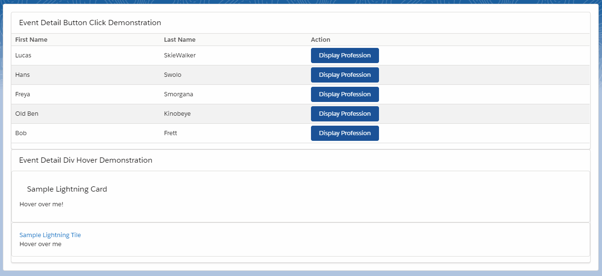

# Event Detail Demonstration
The purpose of this project is to illustrate how to fire custom events with dynamic details using lightning web components.

## Event Detail Button
This component renders a lightning button and fires a custom payload with a dynamic detail whenever the button is clicked.

## Event Detail Div
This component renders a div and fires a custom payload with a dynamic detail whenever the div is hovered over. Use the "body" slot to pass markup into the div itself.